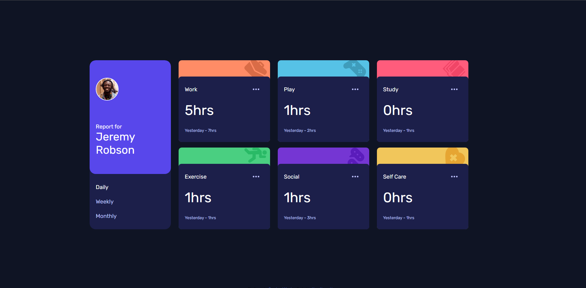
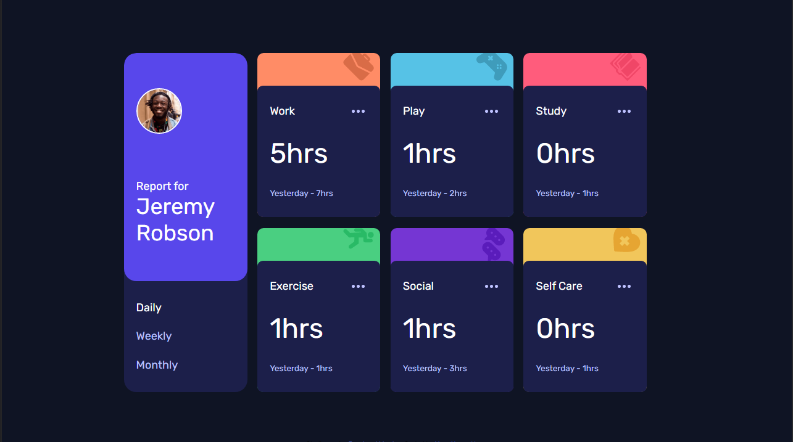
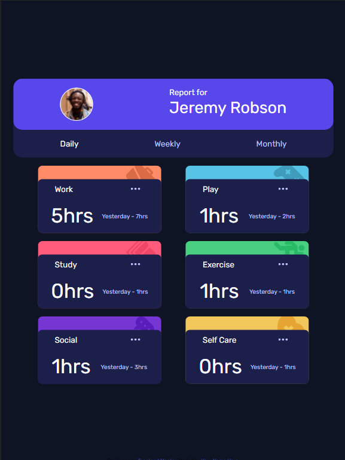
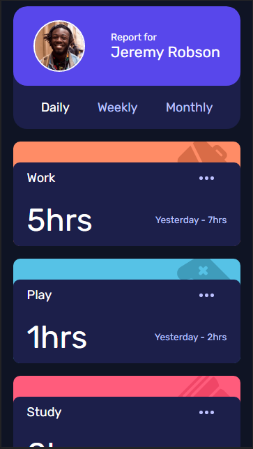

# Frontend Mentor - Time tracking dashboard solution

This is a solution to the [Time tracking dashboard challenge on Frontend Mentor](https://www.frontendmentor.io/challenges/time-tracking-dashboard-UIQ7167Jw). Frontend Mentor challenges help you improve your coding skills by building realistic projects. 

## Table of contents

- [Overview](#overview)
  - [The challenge](#the-challenge)
  - [Screenshot](#screenshot)
  - [Links](#links)
- [My process](#my-process)
  - [Built with](#built-with)
  - [What I learned](#what-i-learned)
  - [Continued development](#continued-development)
  - [Useful resources](#useful-resources)
- [Author](#author)

**Note: Delete this note and update the table of contents based on what sections you keep.**

## Overview

### The challenge

Users should be able to:

- View the optimal layout for the site depending on their device's screen size
- See hover states for all interactive elements on the page
- Switch between viewing Daily, Weekly, and Monthly stats

### Screenshot

Resolution FHD  


Resolution HD  


Tablet View  


Mobile  



### Links

- Solution URL: [Code in GitHub](https://github.com/Dikkas/JSThings/tree/main/TimeTracking)
- Live Site URL: [Live Time Tracking](https://dikkas.github.io/JSThings/TimeTracking/index.html)

## My process

### Built with

- Semantic HTML5 markup
- CSS custom properties
- Flexbox
- Media Query


### What I learned

How to work with fetch in Javascript and then I may try to use some API's with Javascript. Below I put the basic code for fecthing code.

```js
fetch('http://example.com/movies.json')
  .then(response => response.json())
  .then(data => console.log(data));
}
```
For more info in how to use Fetch: [Developer Documentation](https://developer.mozilla.org/en-US/docs/Web/API/Fetch_API/Using_Fetch)

How to Blend a Color with a SVG image in CSS

```css
.any-css-class {
  background-color: var(--clr-PaleBlue);
  mask: url("../images/icon-ellipsis.svg") no-repeat center;
  -webkit-mask: url("../images/icon-ellipsis.svg") no-repeat center;
}
```
For my info in how to use Mark: [Developer Documentation](https://developer.mozilla.org/en-US/docs/Web/CSS/mask)


### Continued development

I Should Insist in the use of Flexbox and in Fetch feature with Javascript

### Useful resources

- [Developer Documentation](https://developer.mozilla.org/en-US/docs/Web/CSS/mask)
- [Stackoverflow Blend SVG with Color](https://stackoverflow.com/questions/24933430/img-src-svg-changing-the-styles-with-css) - This helped me the blend of the SVG and a Color while using a hover pseudo-class in css
- [Developer Documentation](https://developer.mozilla.org/en-US/docs/Web/API/Fetch_API/Using_Fetch) - This documentation is the simple way to understand how to Fetch in Javascript.


## Author

- GitHub - [Dikkas](https://github.com/Dikkas)
- Frontend Mentor - [Dikkas](https://www.frontendmentor.io/profile/Dikkas)


